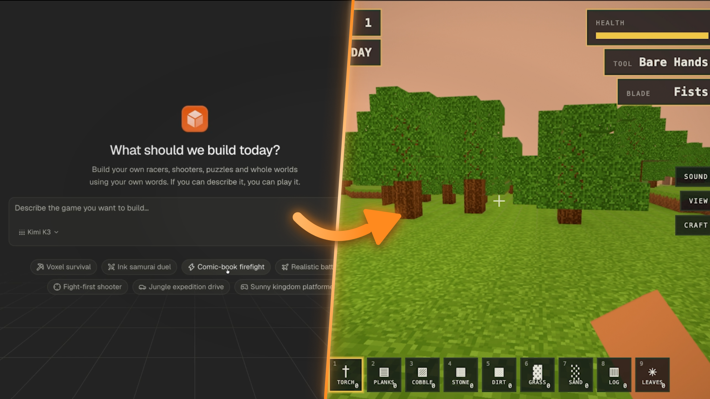
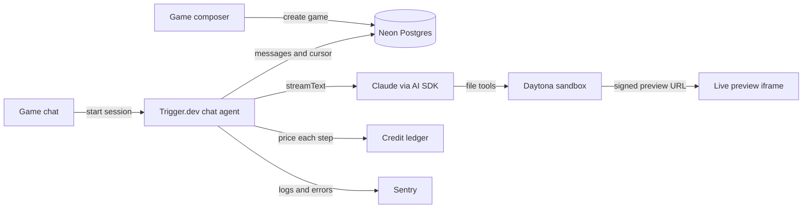

<div align="center">

<br />
<br />

<h1>Sandbox</h1>

<p><strong>Describe a game. Watch it come to life. Play it in the browser.</strong></p>

<p>An agentic three.js game builder powered by Claude, the AI SDK, Trigger.dev, and Daytona.</p>

<p>
  <a href="#features">Features</a>&nbsp;&nbsp;&bull;&nbsp;&nbsp;
  <a href="#agent-tools">Tools</a>&nbsp;&nbsp;&bull;&nbsp;&nbsp;
  <a href="#getting-started">Quick start</a>&nbsp;&nbsp;&bull;&nbsp;&nbsp;
  <a href="#deploy-on-railway">Deploy</a>&nbsp;&nbsp;&bull;&nbsp;&nbsp;
  <a href="#how-it-works">Architecture</a>&nbsp;&nbsp;&bull;&nbsp;&nbsp;
  <a href="#tutorial">Tutorial</a>
</p>

<br />

<p>
  <a href="https://ai-sdk.dev/"></a>&nbsp;
  <a href="https://cwa.run/trigger"></a>&nbsp;
  <a href="https://cwa.run/daytona"></a>&nbsp;
  <a href="https://cwa.run/neon"></a>&nbsp;
  <a href="https://cwa.run/clerk"></a>&nbsp;
  <a href="https://cwa.run/sentry"></a>&nbsp;
  <a href="https://cwa.run/railway"></a>
</p>

</div>

<br />



<p align="center"><sub>Describe a game in the composer, then play what the agent builds in the live preview.</sub></p>

<br />

> Type a premise like "a game about a moth", answer a few design questions, and get a playable 3D world running live next to the chat. Every game is built by an AI agent writing real source files into its own cloud sandbox.

---

## Tutorial

<p align="center">
  <a href="https://www.youtube.com/watch?v=pHOCzB5TKv0"></a>
</p>

Each chapter has a matching branch so you can check out the code at any point in the tutorial:

| Branch                     | Chapter                                     |
| -------------------------- | ------------------------------------------- |
| `main`                     | Final project                               |
| `chapter-01-setup`         | Project setup                               |
| `chapter-02-auth`          | Clerk authentication and organizations      |
| `chapter-03-sidebar`       | Dashboard sidebar                           |
| `chapter-04-games`         | Games list and creation                     |
| `chapter-05-ai-chat`       | AI chat with the AI SDK                     |
| `chapter-06-durability`    | Durable chat with Trigger.dev               |
| `chapter-07-sandboxing`    | Daytona sandboxes and live preview          |
| `chapter-08-game-engine`   | three.js game engine                        |
| `chapter-09-briefing`      | Briefing questions with the ask_player tool |
| `chapter-10-observability` | Sentry observability                        |
| `chapter-11-ai-models`     | Model picker                                |
| `chapter-12-billing`       | Credits and Clerk Billing                   |
| `chapter-13-bug-fixing`    | Bug fixing                                  |

```bash
git checkout chapter-07-sandboxing  # example: jump to Daytona sandboxes
```

---

## Features

<table>
  <tr>
    <td width="50%" valign="top">
      <strong>Describe-to-build games</strong><br />
      Turn a plain-English premise into a running three.js game, then iterate on it turn by turn.
    </td>
    <td width="50%" valign="top">
      <strong>Live preview</strong><br />
      Play the game in an iframe next to the chat. The preview reloads when a turn ends and reports runtime errors back to the panel.
    </td>
  </tr>
  <tr>
    <td width="50%" valign="top">
      <strong>Isolated cloud sandboxes</strong><br />
      Every game gets its own Daytona sandbox where the agent reads, writes, and serves the game files.
    </td>
    <td width="50%" valign="top">
      <strong>Briefing before building</strong><br />
      The agent settles loop, goal, challenge, controls, world, look, and feel with one question at a time before writing code.
    </td>
  </tr>
  <tr>
    <td width="50%" valign="top">
      <strong>Durable agent turns</strong><br />
      Turns run as Trigger.dev chat agents, so a page reload resumes the stream instead of losing it.
    </td>
    <td width="50%" valign="top">
      <strong>Batteries-included engine</strong><br />
      A seeded engine toolkit covers rendering, input, lighting, materials, physics, particles, HUD, sound, and post effects.
    </td>
  </tr>
  <tr>
    <td width="50%" valign="top">
      <strong>Model picker</strong><br />
      Build with Opus 5, Sonnet 5, or Haiku 4.5, each priced per token from Anthropic's published rates.
    </td>
    <td width="50%" valign="top">
      <strong>Credits and billing</strong><br />
      Every organization starts with free credits, and a Clerk Billing plan tops them up monthly with unused credits rolling over.
    </td>
  </tr>
  <tr>
    <td width="50%" valign="top">
      <strong>Organization workspaces</strong><br />
      Games, sandboxes, and credit ledgers are isolated by Clerk organization.
    </td>
    <td width="50%" valign="top">
      <strong>Full observability</strong><br />
      Sentry captures errors, structured logs, and source-mapped stack traces across the app and the Trigger.dev worker.
    </td>
  </tr>
</table>

<br />

## Agent Tools

| Tool           | Description                                                                  |
| -------------- | ---------------------------------------------------------------------------- |
| `ask_player`   | Puts one design question to the player and pauses the turn until they answer |
| `list_files`   | Lists the files in the game directory                                        |
| `read_file`    | Reads a file from the game directory                                         |
| `write_file`   | Creates or fully replaces a file in the game directory                       |
| `replace_text` | Replaces an exact snippet of text inside an existing file                    |
| `delete_file`  | Deletes a file or directory the game no longer uses                          |

Every path is resolved inside the sandbox's game directory, which is also the directory the preview server serves. The agent cannot touch anything outside it.

---

## Getting Started

### Prerequisites

- Node.js and npm
- [Anthropic](https://www.anthropic.com/) API key
- [Clerk](https://cwa.run/clerk) application with Organizations enabled
- PostgreSQL database, such as [Neon](https://cwa.run/neon)
- [Trigger.dev](https://cwa.run/trigger) project
- [Daytona](https://www.daytona.io/) account
- Optional [Sentry](https://cwa.run/sentry) project for error monitoring and source maps

### 1. Clone and install

```bash
git clone git@github.com:code-with-antonio/sandbox.git
cd sandbox
npm install
```

### 2. Configure environment

Create `.env.local` in the project root and fill in the service credentials:

```bash
NEXT_PUBLIC_CLERK_SIGN_IN_URL=/sign-in
NEXT_PUBLIC_CLERK_SIGN_UP_URL=/sign-up
NEXT_PUBLIC_CLERK_SIGN_IN_FALLBACK_REDIRECT_URL=/
NEXT_PUBLIC_CLERK_SIGN_UP_FALLBACK_REDIRECT_URL=/

# Clerk
NEXT_PUBLIC_CLERK_PUBLISHABLE_KEY=
CLERK_SECRET_KEY=

# Neon
NEON_BRANCH=main
DATABASE_URL=
DATABASE_URL_UNPOOLED=

# AI
ANTHROPIC_API_KEY=

# Trigger.dev
TRIGGER_SECRET_KEY=

# Daytona
DAYTONA_API_KEY=

# Sentry
NEXT_PUBLIC_SENTRY_DSN=
SENTRY_DSN=
SENTRY_ORG=
SENTRY_PROJECT=
SENTRY_AUTH_TOKEN=
NEXT_PUBLIC_SENTRY_ENVIRONMENT=
```

### 3. Configure Clerk

Create a Clerk application and enable Organizations. The dashboard requires an active organization, and every game and credit ledger is scoped to the current organization.

To sell credits, configure Clerk Billing with an organization plan that has a monthly base fee. The billing page renders Clerk's `PricingTable`, and the app grants credits for each month a paid subscription has been active. Update the plan name and monthly amount on the billing page and in `lib/billing/reconcile.ts` if yours differ from the defaults.

### 4. Set up the database

Push the Drizzle schema directly to the database:

```bash
npm run db:push
```

Schema pushes use `DATABASE_URL_UNPOOLED`, since they must not go through the connection pooler. This project does not use migration files.

### 5. Configure integrations

Create a Trigger.dev project and set its project ref in `trigger.config.ts`. Add your Daytona API key for sandbox creation and preview URLs, and your Anthropic API key for the game-building models.

If you use Sentry, update the `org` and `project` values in `next.config.ts` to match your own Sentry project.

### 6. Run Trigger.dev

Start the Trigger.dev development worker in a separate terminal:

```bash
npm run trigger:dev
```

The worker discovers tasks under `trigger/` using `trigger.config.ts`. The chat agent runs there, so the app cannot build games without it.

### 7. Run the app

```bash
npm run dev
```

Open [http://localhost:3000](http://localhost:3000), sign in, select or create an organization, and describe your first game.

---

## Deploy on Railway

[Railway](https://cwa.run/railway) can build and host the Next.js application directly from this repository.

### 1. Create the service

Push the repository to GitHub, create a Railway project, and choose **Deploy from GitHub repo**. Railway Railpack detects the Node.js application and installs dependencies from `package-lock.json`.

If automatic detection needs to be overridden, use:

| Setting       | Value           |
| ------------- | --------------- |
| Build command | `npm run build` |
| Start command | `npm start`     |

You can also deploy the current directory with the Railway CLI:

```bash
railway login
railway init
railway up --detach -m "Initial deployment"
```

### 2. Add production variables

Copy the values from `.env.local` into the Railway service variables. Use production credentials for Clerk, Neon, Anthropic, Trigger.dev, Daytona, and Sentry.

```bash
NEXT_PUBLIC_CLERK_SIGN_IN_URL=/sign-in
NEXT_PUBLIC_CLERK_SIGN_UP_URL=/sign-up
NEXT_PUBLIC_CLERK_SIGN_IN_FALLBACK_REDIRECT_URL=/
NEXT_PUBLIC_CLERK_SIGN_UP_FALLBACK_REDIRECT_URL=/

NEXT_PUBLIC_CLERK_PUBLISHABLE_KEY=
CLERK_SECRET_KEY=

DATABASE_URL=
DATABASE_URL_UNPOOLED=
ANTHROPIC_API_KEY=
TRIGGER_SECRET_KEY=
DAYTONA_API_KEY=

NEXT_PUBLIC_SENTRY_DSN=
SENTRY_DSN=
SENTRY_ORG=
SENTRY_PROJECT=
SENTRY_AUTH_TOKEN=
NEXT_PUBLIC_SENTRY_ENVIRONMENT=production
```

`SENTRY_AUTH_TOKEN` is only required when uploading source maps during the production build. Sentry releases are named after `RAILWAY_GIT_COMMIT_SHA`, which Railway provides automatically.

### 3. Prepare production services

Push the schema to the production database before serving traffic:

```bash
npm run db:push
```

Deploy the chat agent to Trigger.dev separately. Railway hosts the Next.js application, while Trigger.dev runs the durable agent turns:

```bash
npm run trigger:deploy
```

The deploy bundles the sandbox seed files, installs the Daytona SDK as a real dependency in the worker, and uploads worker source maps to Sentry when `SENTRY_ORG`, `SENTRY_PROJECT`, and `SENTRY_AUTH_TOKEN` are set. Make sure the Railway service uses the production `TRIGGER_SECRET_KEY` from the same Trigger.dev project and environment.

### 4. Configure the domain

Generate a Railway domain from the service settings or connect a custom domain. Add the production domain to your Clerk application and any service allowlists that restrict application origins.

Every push to the connected branch creates a new Railway deployment. Check the build and runtime logs from the Railway dashboard if a release fails.

---

## How It Works



1. **Create** - The home page composer saves a new game to Postgres and opens its chat with the prompt auto-submitted.
2. **Sandbox** - The first turn creates a Daytona sandbox and seeds it with the runtime and the three.js engine toolkit.
3. **Brief** - The agent asks one design question at a time, and each answer resumes the turn where it stopped.
4. **Build** - Claude writes and edits game files through sandboxed tools, with tool calls streamed to the chat.
5. **Preview** - A server route starts a static server in the sandbox and returns a signed preview URL for the iframe.
6. **Persist** - Each completed turn stores the messages and the session cursor, so a reload resumes an interrupted stream.
7. **Bill** - Every model step is priced by token class and charged to the organization's credit ledger.

<br />

## Project Structure

```text
app/
├── (app)/                      # Home composer, game page, and billing page
├── api/games/[id]/preview/     # Starts the sandbox server and signs a preview URL
├── sign-in/                    # Clerk sign-in
└── sign-up/                    # Clerk sign-up
components/
├── app-sidebar.tsx             # Games list, credits, organization and user menus
├── chat-composer.tsx           # Message input with model picker
├── chat-preview.tsx            # Live game iframe and runtime error reporting
├── chat-thread.tsx             # Streamed messages, tool calls, and briefing questions
├── game-chat.tsx               # Chat transport wiring and preview refresh
├── new-game-composer.tsx       # Home page prompt and suggestions
└── ui/                         # Shared UI primitives
lib/
├── billing/                    # Credit ledger, per-token pricing, and Clerk Billing reconciliation
├── daytona/                    # Sandbox creation, lookup, deletion, and preview server
├── db/                         # Drizzle schema and Neon client
├── games/
│   ├── instructions/           # Agent system prompt: workflow, runtime, and engine
│   ├── runtime/                # Files seeded into every sandbox, including the engine
│   ├── actions.ts              # Create, rename, and delete games
│   ├── chat-actions.ts         # Chat session start and token minting
│   ├── chat-store.ts           # Message and session persistence
│   ├── model-catalog.ts        # Selectable models and their copy
│   └── tools.ts                # Sandboxed file tools and ask_player
└── observability.ts            # Shared Sentry logger for app and worker
trigger/
├── chat.ts                     # The game-chat Trigger.dev chat agent
└── init.ts                     # Sentry setup and lifecycle hooks for the worker
neon.ts                         # Neon branch policy
trigger.config.ts               # Trigger.dev build and deploy configuration
```

---

## Scripts

| Command                  | Description                                      |
| ------------------------ | ------------------------------------------------ |
| `npm run dev`            | Start the Next.js development server             |
| `npm run build`          | Create a production build                        |
| `npm start`              | Start the production server                      |
| `npm run lint`           | Run ESLint                                       |
| `npm run format`         | Format TypeScript and TSX files with Prettier    |
| `npm run typecheck`      | Run TypeScript without emitting files            |
| `npm run db:push`        | Push the Drizzle schema directly to the database |
| `npm run db:studio`      | Open Drizzle Studio                              |
| `npm run trigger:dev`    | Start the Trigger.dev development worker         |
| `npm run trigger:deploy` | Deploy tasks to Trigger.dev                      |

<br />

## Stack

| Technology                 | Purpose                                                        |
| -------------------------- | -------------------------------------------------------------- |
| Next.js 16 and React 19    | Application framework and interface                            |
| AI SDK                     | Streaming chat, tool calling, and the Anthropic model provider |
| Trigger.dev                | Durable chat agent runs, resumable streams, and retries        |
| Daytona                    | Per-game cloud sandboxes and signed preview URLs               |
| three.js                   | 3D rendering inside the seeded game engine                     |
| Clerk                      | Authentication, organizations, and subscription billing        |
| Neon and Drizzle           | Serverless Postgres and typed database access                  |
| Sentry                     | Frontend, server, edge, and worker monitoring with source maps |
| shadcn/ui and Tailwind CSS | UI components and styling                                      |
